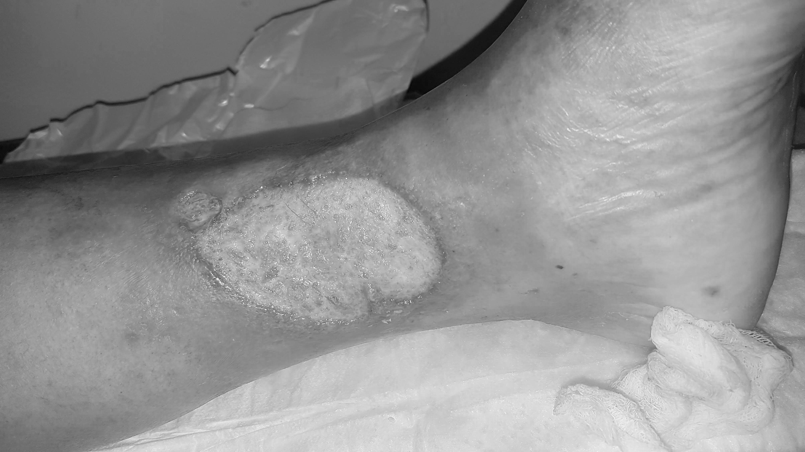

# Ecualización Paralela de Histograma con MPI

Este proyecto implementa una ecualización de histograma en paralelo para imágenes a color usando **MPI (Message Passing Interface)** en Python. El objetivo es acelerar el procesamiento de imágenes distribuyendo el cálculo de cada canal de color (R, G, B) a un proceso separado.

## Descripción del Problema

En el análisis de imágenes (especialmente médicas), la ecualización de histograma es una técnica fundamental para realzar texturas y bordes. En una imagen RGB, este proceso debe aplicarse a cada canal. Este proyecto utiliza un diseño **Master-Worker** para paralelizar esta tarea.

## Arquitectura del Sistema (SPMD)

El script está diseñado para ejecutarse con **4 procesos** (`mpirun -n 4`):

* **Rank 0 (Master):**
    1.  Carga la imagen desde el disco.
    2.  Ejecuta una versión secuencial para benchmarking ($T_s$).
    3.  Inicia el temporizador paralelo ($T_p$).
    4.  Separa los canales **B, G, R** y los envía a los workers 1, 2 y 3.
    5.  Espera y recibe los canales procesados de vuelta.
    6.  Detiene el temporizador, reensambla la imagen final y calcula el Speedup.

* **Rank 1 (Worker B):** Recibe el canal Azul, aplica la ecualización y lo devuelve.
* **Rank 2 (Worker G):** Recibe el canal Verde, aplica la ecualización y lo devuelve.
* **Rank 3 (Worker R):** Recibe el canal Rojo, aplica la ecualización y lo devuelve.

##  Dependencias

Para ejecutar este script, necesitas:

* Python 3.x
* Una implementación de MPI (como Open MPI o MPICH)
* Las siguientes bibliotecas de Python:
    * `numpy`
    * `opencv-python`
    * `mpi4py`

Puedes instalar las bibliotecas de Python con:
```bash
pip install -r requirements.txt
```

##  Cómo Ejecutar

1.  Clona este repositorio:
    ```bash
    git https://github.com/dlfno/MPI-en-an-lisis-de-Im-genes-m-dicas
    cd MPI_En_Análisis_Imágenes_Médicas
    ```

2.  Instala las dependencias:
    ```bash
    pip install -r requirements.txt
    ```

3.  Ejecuta el script con `mpirun`, especificando 4 procesos y la ruta a tu imagen:
    ```bash
    mpirun -n 4 python parallel_hist_eq.py "ruta/a/tu/imagen.jpg"
    ```

##  Análisis de Resultados

El script genera varios archivos de salida, incluyendo `imagen_ecualizada_final.png` y los canales individuales.

### 1. Realce de Textura (Éxito)

El objetivo principal de realzar la textura se cumple exitosamente. Al comparar un canal original (ej. Rojo) con su versión ecualizada, se observa un drástico aumento en el detalle, especialmente en áreas sobreexpuestas ("quemadas") o muy oscuras.

| Canal Rojo - Original | Canal Rojo - Ecualizado |
| :---: | :---: |
|  |  |
| (Textura perdida en el brillo) | (Textura y bordes claramente visibles) |
### 2. Distorsión de Color (Efecto Esperado)

La imagen final a color (`imagen_ecualizada_final.png`) presentará una **fuerte distorsión de color**.

| Imagen Original | Imagen Ecualizada (RGB) |
| :---: | :---: |
|  |  || Imagen Original | Imagen Ecualizada (RGB) |

Esto **no es un error**. Es el resultado esperado de ecualizar los canales R, G y B de forma independiente, lo cual rompe el balance de color original. Este proyecto demuestra *cómo* paralelizar la tarea, y el resultado visual es una lección clave sobre el procesamiento de color.
